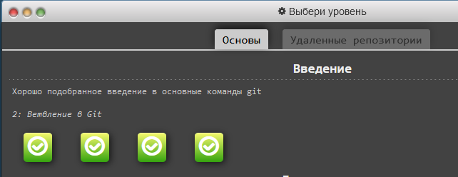

# Hello kottans-frontend!

### I'm glad to join to this course

This is my first communication on github.

> *I love dogs more, but I'm with you anyway.* :smile:

## Stage 0. Self-Study

### General

- [x] Git Basics

  - [x] Introduction to Git and GitHub
   - [x] week 1
      
 
 what is done 

      
     
     
      

   - [x] week 2
      
 
      
 what is done 

      
      
      
   
      
 - [x] learngitbranching.js.org:
    - [x] Основи: Introduction Sequence
       
 
 what is done 

       
         
       

    - [x] Віддалені репозиторії: Push & Pull – віддалені репозиторії в Git!
       
 
 what is done 

       
         
       

       
  - [x]  Створіть репозиторій та назвіть його kottans-frontend
  - [x]  Створіть README.md для репозиторію.
  - [x]  Надішліть pull-request сюди Kottans/mock-repo пропонуючи зміни
      
- [x] Linux CLI and Networking
- [ ] VCS (hello gitty), GitHub and Collaboration

